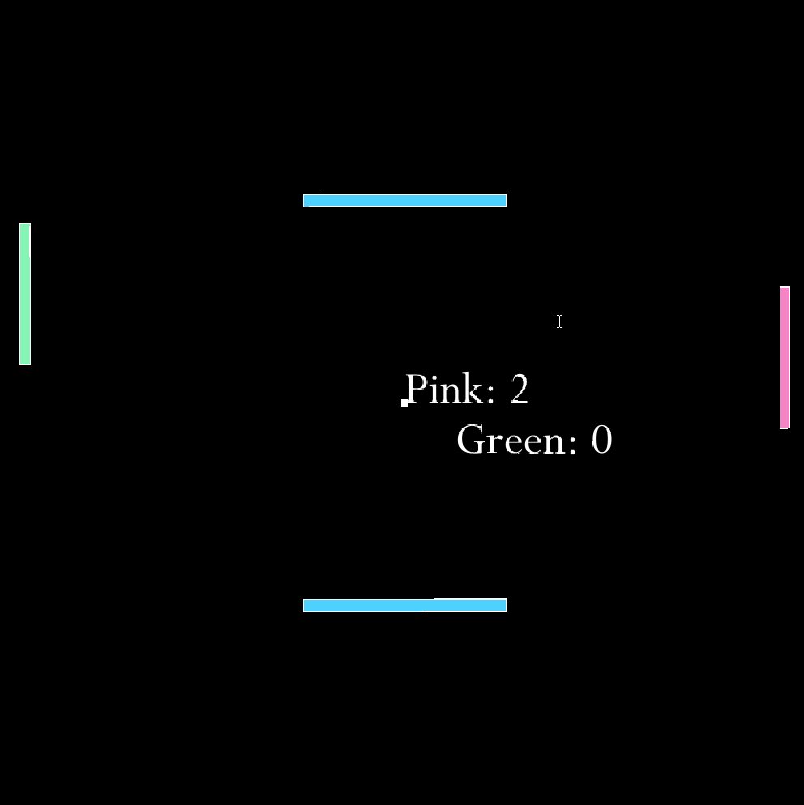
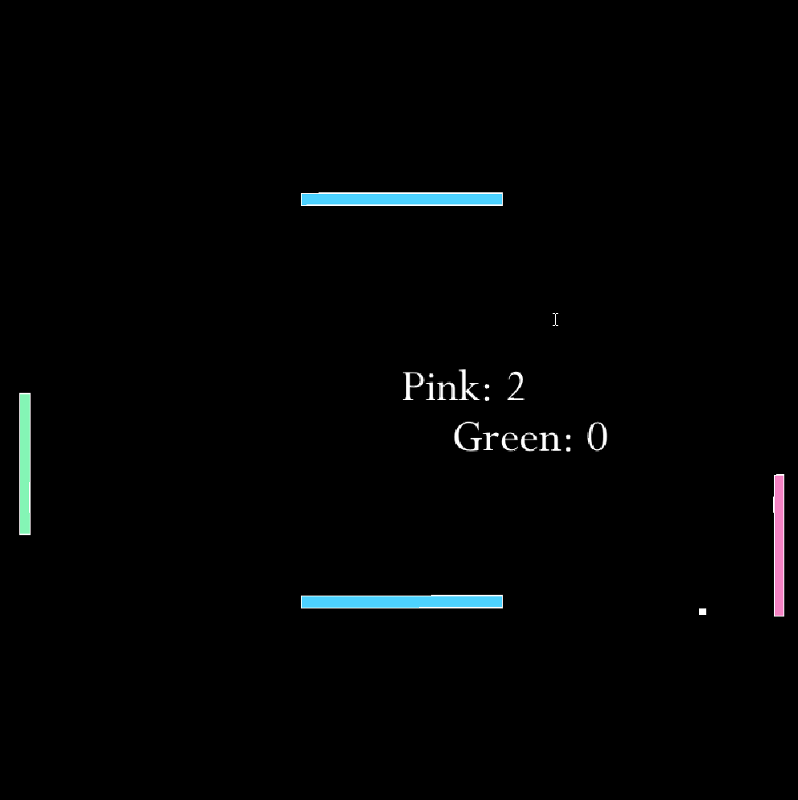

# pong

Pong using the Processing library.

I added obstacles in the middle, as well as a way of calculating the exit angle of the ball based off of its speed, its angle to the paddle, and where it hit the paddle, as well as the direction the paddle is moving. 

**In other words: You can curve the ball.**

Pink side also gets the advantage of not getting randomly struck by Zeus every now and then to force a miss. My friends kept picking green, so I had to find some way to dissuade them. This was the way.

